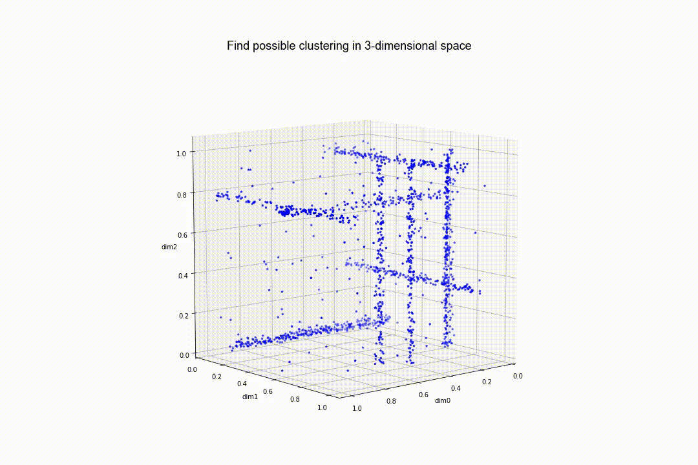

# P3C-visualisation
Visualisation of different steps of the P3C Subspace Clustering Algorithm.

### General

Created as part of an university project at LMU Munich, an overview can be found [here](https://dsl.ifi.lmu.de/cms/innovation_lab/projects/sose2017/index.html). Provides the missing animation belonging to the final [presentation](http://www.dbs.ifi.lmu.de/Lehre/Praktikum/SS17/BigDataScience/finalPresentations/flinke_apache.pdf).

### Code
Animation was created using Python (matplotlib), code will be added at a later time.

### References

Dataset: Taken from R 'subspace' package, [link](https://cran.r-project.org/web/packages/subspace/subspace.pdf).

P3C Algorithm: [link](https://ieeexplore.ieee.org/document/4053068)

P3C+MR: [link](https://openproceedings.org/2014/conf/edbt/FriesWS14.pdf)
